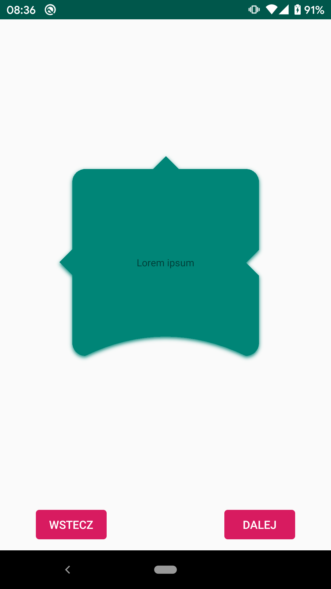

# Custom Rounded Shapes

##  com.google.android.material:material:1.0.0

Pros:
- Custom shape
- Shadow

Cons:
- Issue with attributes like: color of shadow, radius od elevation.

~~~
class MaterialVariantFragment : Fragment(R.layout.fragment_material_variant) {

    override fun onViewCreated(view: View, savedInstanceState: Bundle?) {
        super.onViewCreated(view, savedInstanceState)

        val radius = resources.getDimensionPixelSize(R.dimen.radius)
        val mainView = view.findViewById<LinearLayout>(R.id.mainView)

        val shapePathModel = ShapePathModel().apply {
            setAllCorners(RoundedCornerTreatment(radius.toFloat()))
            setAllEdges(TriangleEdgeTreatment(radius.toFloat(), false))

            rightEdge = TriangleEdgeTreatment(radius.toFloat(), true)
            bottomEdge = CurvedEdgeTreatment(radius.toFloat() * 3)
        }

        mainView.background = MaterialShapeDrawable(shapePathModel).apply {
            setTint(ContextCompat.getColor(requireContext(), R.color.colorPrimary))
            paintStyle = Paint.Style.FILL
            isShadowEnabled = true
        }
    }

    class CurvedEdgeTreatment(val size: Float) : EdgeTreatment() {
        override fun getEdgePath(length: Float, interpolation: Float, shapePath: ShapePath) {
            shapePath.quadToPoint(length / 2f, size * interpolation, length, 0f)
        }
    }
}
~~~

Tips:
- Remember about `android:clipChildren="false"` (`android:clipToPadding="false"` would be helpful but is optional)

~~~
<?xml version="1.0" encoding="utf-8"?>
<androidx.constraintlayout.widget.ConstraintLayout
    xmlns:android="http://schemas.android.com/apk/res/android"
    xmlns:tools="http://schemas.android.com/tools"
    xmlns:app="http://schemas.android.com/apk/res-auto"
    android:layout_width="match_parent"
    android:layout_height="match_parent"
    android:clipToPadding="false"
    android:clipChildren="false"
    tools:context=".OutlineWidgetVariantFragment">

    <LinearLayout
        android:id="@+id/mainView"
        android:layout_width="wrap_content"
        android:layout_height="wrap_content"
        android:padding="16dp"
        android:orientation="horizontal"
        app:layout_constraintTop_toTopOf="parent"
        app:layout_constraintBottom_toBottomOf="parent"
        app:layout_constraintStart_toStartOf="parent"
        app:layout_constraintEnd_toEndOf="parent">

        <LinearLayout
            android:id="@+id/backgroundView"
            android:layout_width="match_parent"
            android:layout_height="match_parent"
            android:orientation="horizontal"
            app:layout_constraintTop_toTopOf="parent"
            app:layout_constraintBottom_toBottomOf="parent"
            app:layout_constraintStart_toStartOf="parent"
            app:layout_constraintEnd_toEndOf="parent"
            tools:ignore="UselessParent">

            <TextView
                android:layout_width="200dp"
                android:layout_height="200dp"
                android:gravity="center"
                android:text="@string/lorem_ipsum"
                android:textAppearance="@style/TextAppearance.AppCompat.Caption" />

        </LinearLayout>

    </LinearLayout>

</androidx.constraintlayout.widget.ConstraintLayout>
~~~

## com.google.android.material:material:1.1.0-beta01

Pros:
- Custom shape
- Shadow with custom color

~~~
class MaterialVariantFragment : Fragment(R.layout.fragment_material_variant) {

    override fun onViewCreated(view: View, savedInstanceState: Bundle?) {
        super.onViewCreated(view, savedInstanceState)

        val radius = resources.getDimensionPixelSize(R.dimen.radius)
        val elevation = resources.getDimensionPixelSize(R.dimen.elevation)
        val backgroundView = view.findViewById<LinearLayout>(R.id.backgroundView)

        val model = ShapeAppearanceModel()
            .toBuilder()
            .setAllCornerSizes(radius.toFloat())
            .setAllEdges(TriangleEdgeTreatment(radius.toFloat(), false))
            .setTopLeftCorner(CornerFamily.CUT, radius.toFloat() * 3)
            .setBottomRightCorner(CornerFamily.CUT, radius.toFloat() * 5)
            .setLeftEdge(TriangleEdgeTreatment(radius.toFloat() * 2, true))
            .build()

        backgroundView.background = MaterialShapeDrawable().apply {
            shapeAppearanceModel = model
            fillColor = ColorStateList.valueOf(Color.MAGENTA)
            setElevation(elevation.toFloat() * 5)
            setShadowColor(Color.GREEN)
        }
    }
}
~~~

~~~
<?xml version="1.0" encoding="utf-8"?>
<androidx.constraintlayout.widget.ConstraintLayout
    xmlns:android="http://schemas.android.com/apk/res/android"
    xmlns:app="http://schemas.android.com/apk/res-auto"
    xmlns:tools="http://schemas.android.com/tools"
    android:layout_width="match_parent"
    android:layout_height="match_parent"
    android:clipChildren="false"
    android:clipToPadding="false"
    tools:context=".MaterialVariantFragment">

    <LinearLayout
        android:id="@+id/backgroundView"
        android:layout_width="250dp"
        android:layout_height="250dp"
        android:orientation="horizontal"
        app:layout_constraintBottom_toBottomOf="parent"
        app:layout_constraintEnd_toEndOf="parent"
        app:layout_constraintStart_toStartOf="parent"
        app:layout_constraintTop_toTopOf="parent"
        tools:ignore="UselessParent">

        <TextView
            android:id="@+id/lorem"
            android:layout_width="match_parent"
            android:layout_height="match_parent"
            android:gravity="center"
            android:text="@string/lorem_ipsum"
            android:clickable="true"
            android:focusable="true"
            android:background="?android:attr/selectableItemBackground"
            android:textAppearance="@style/TextAppearance.AppCompat.Caption" />

    </LinearLayout>

</androidx.constraintlayout.widget.ConstraintLayout>
~~~

### Useful links:
- https://medium.com/@Zielony/clipping-and-shadows-on-android-e702a0d96bd4
- https://medium.com/better-programming/practical-image-porterduff-mode-usage-in-android-3b4b5d2e8f5f
- https://medium.com/ackee/create-beautiful-shapes-with-materialshapedrawable-874dd46e0fd5
- https://github.com/material-components/material-components-android
