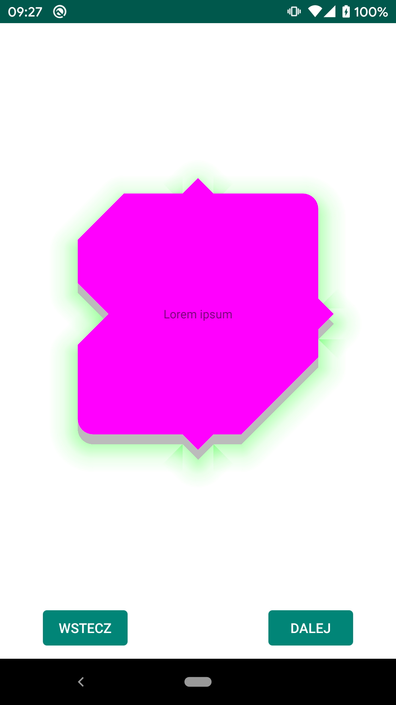

# Custom Rounded Shapes

##  com.google.android.material:material:1.0.0

"The MaterialShapeDrawable class offers us to define the shape by specifying how the edges and the corners of the final shape should look like ... There is possibility to enable the shadow casting using the shadowEnabled property. You can even specify the radius, elevation and the tint of the shadow ... Unfortunately if you try to use the shadow with the MaterialShapeDrawable you end up with the nice shadow, painted using the setShadowLayer of the Paint class, intended for text shadows drawing" [2]

~~~
class MaterialVariantFragment : Fragment(R.layout.fragment_material_variant) {

    override fun onViewCreated(view: View, savedInstanceState: Bundle?) {
        super.onViewCreated(view, savedInstanceState)

        val radius = resources.getDimensionPixelSize(R.dimen.radius)
        val mainView = view.findViewById<LinearLayout>(R.id.mainView)

        val shapePathModel = ShapePathModel().apply {
            setAllCorners(RoundedCornerTreatment(radius.toFloat()))
            setAllEdges(TriangleEdgeTreatment(radius.toFloat(), false))

            rightEdge = TriangleEdgeTreatment(radius.toFloat(), true)
            bottomEdge = CurvedEdgeTreatment(radius.toFloat() * 3)
        }

        mainView.background = MaterialShapeDrawable(shapePathModel).apply {
            setTint(ContextCompat.getColor(requireContext(), R.color.colorPrimary))
            paintStyle = Paint.Style.FILL
            isShadowEnabled = true
        }
    }

    class CurvedEdgeTreatment(val size: Float) : EdgeTreatment() {
        override fun getEdgePath(length: Float, interpolation: Float, shapePath: ShapePath) {
            shapePath.quadToPoint(length / 2f, size * interpolation, length, 0f)
        }
    }
}
~~~

Tips:
- Remember about `android:clipChildren="false"` (`android:clipToPadding="false"` would be helpful but is optional)

~~~
<?xml version="1.0" encoding="utf-8"?>
<androidx.constraintlayout.widget.ConstraintLayout
    xmlns:android="http://schemas.android.com/apk/res/android"
    xmlns:tools="http://schemas.android.com/tools"
    xmlns:app="http://schemas.android.com/apk/res-auto"
    android:layout_width="match_parent"
    android:layout_height="match_parent"
    android:clipToPadding="false"
    android:clipChildren="false"
    tools:context=".OutlineWidgetVariantFragment">

    <LinearLayout
        android:id="@+id/mainView"
        android:layout_width="wrap_content"
        android:layout_height="wrap_content"
        android:padding="16dp"
        android:orientation="horizontal"
        app:layout_constraintTop_toTopOf="parent"
        app:layout_constraintBottom_toBottomOf="parent"
        app:layout_constraintStart_toStartOf="parent"
        app:layout_constraintEnd_toEndOf="parent">

        <LinearLayout
            android:id="@+id/backgroundView"
            android:layout_width="match_parent"
            android:layout_height="match_parent"
            android:orientation="horizontal"
            app:layout_constraintTop_toTopOf="parent"
            app:layout_constraintBottom_toBottomOf="parent"
            app:layout_constraintStart_toStartOf="parent"
            app:layout_constraintEnd_toEndOf="parent"
            tools:ignore="UselessParent">

            <TextView
                android:layout_width="200dp"
                android:layout_height="200dp"
                android:gravity="center"
                android:text="@string/lorem_ipsum"
                android:textAppearance="@style/TextAppearance.AppCompat.Caption" />

        </LinearLayout>

    </LinearLayout>

</androidx.constraintlayout.widget.ConstraintLayout>
~~~

## com.google.android.material:material:1.1.0-beta01

Pros:
- Custom shape
- Shadow with custom color

~~~
class MaterialVariantFragment : Fragment(R.layout.fragment_material_variant) {

    override fun onViewCreated(view: View, savedInstanceState: Bundle?) {
        super.onViewCreated(view, savedInstanceState)

        val radius = resources.getDimensionPixelSize(R.dimen.radius)
        val elevation = resources.getDimensionPixelSize(R.dimen.elevation)
        val backgroundView = view.findViewById<LinearLayout>(R.id.backgroundView)

        val model = ShapeAppearanceModel()
            .toBuilder()
            .setAllCornerSizes(radius.toFloat())
            .setAllEdges(TriangleEdgeTreatment(radius.toFloat(), false))
            .setTopLeftCorner(CornerFamily.CUT, radius.toFloat() * 3)
            .setBottomRightCorner(CornerFamily.CUT, radius.toFloat() * 5)
            .setLeftEdge(TriangleEdgeTreatment(radius.toFloat() * 2, true))
            .build()

        backgroundView.background = MaterialShapeDrawable().apply {
            shapeAppearanceModel = model
            fillColor = ColorStateList.valueOf(Color.MAGENTA)
            setElevation(elevation.toFloat() * 5)
            setShadowColor(Color.GREEN)
        }
    }
}
~~~

~~~
<?xml version="1.0" encoding="utf-8"?>
<androidx.constraintlayout.widget.ConstraintLayout
    xmlns:android="http://schemas.android.com/apk/res/android"
    xmlns:app="http://schemas.android.com/apk/res-auto"
    xmlns:tools="http://schemas.android.com/tools"
    android:layout_width="match_parent"
    android:layout_height="match_parent"
    android:clipChildren="false"
    android:clipToPadding="false"
    tools:context=".MaterialVariantFragment">

    <LinearLayout
        android:id="@+id/backgroundView"
        android:layout_width="250dp"
        android:layout_height="250dp"
        android:orientation="horizontal"
        app:layout_constraintBottom_toBottomOf="parent"
        app:layout_constraintEnd_toEndOf="parent"
        app:layout_constraintStart_toStartOf="parent"
        app:layout_constraintTop_toTopOf="parent"
        tools:ignore="UselessParent">

        <TextView
            android:id="@+id/lorem"
            android:layout_width="match_parent"
            android:layout_height="match_parent"
            android:gravity="center"
            android:text="@string/lorem_ipsum"
            android:clickable="true"
            android:focusable="true"
            android:background="?android:attr/selectableItemBackground"
            android:textAppearance="@style/TextAppearance.AppCompat.Caption" />

    </LinearLayout>

</androidx.constraintlayout.widget.ConstraintLayout>
~~~

## ViewOutlineProvider

### Clip

"Clipping means restricting the drawing of a view’s content to a specific shape ... If the clipped view is a layout then clipping is also applied to its children ... Starting with Android Lollipop there’s a native way of clipping views using view outlines. This method is hardware accelerated, very fast, pretty easy to use, correctly clips the layout’s content and produces antialiased outlines." [1]

"Outlines aren’t just used for shadows, but by default they define the clipping of the view too! ... when the Outline you provide has canClip() returning true, which is the case when the outline is a rectangle, a rounded rectangle, or a circle. Non-round ovals, and arbitrary paths, are not able to provide clipping" [4]

"Outlines represent the outer shape of a graphics object and define the ripple area for touch feedback." [3]

"ViewOutlineProvider can’t clip to shapes other than rectangles, rounded rectangles and circles." Custom paths (even convex ones) are not suported. [1] ... "There’s a small difference in supported shapes when drawing shadows, the outline can be any convex shape, so it’s possible to use custom paths. This leads to weird situations where you can get nice shadows for diagonally cut views, but you have to clip them using a different method." [1]

### Shadow

"The shadow here does not just adapt to different elevation values, but is also translated around and gets a larger or smaller size than the view itself." [4]

"The only limitation is that the shape must be convex. There are convenience methods on Outline to have ellipses, rectangles and rounded rectangles, but you could also use any arbitrary Path, as long as it’s convex." [4]

"Outline is providing the required information for a Material sheet to project a shadow. The default behaviour for Views is to delegate the outline definition to their background drawable. ShapeDrawables for example provide outlines that match their shapes, while ColorDrawables, BitmapDrawables, etc. provide a rectangle matching their bounds." [4]

### Images

### Widget

### Shapes

"If you are targeting API version 21 or higher and use the ShapeDrawable as a background of some element with elevation, you get the correctly shaped shadow efect under the View (works for convex shapes only)." [2]

## Useful links:
- [[1] Clipping and shadows on Android](https://medium.com/@Zielony/clipping-and-shadows-on-android-e702a0d96bd4)
- [[2] Create beautiful shapes with MaterialShapeDrawable](https://medium.com/ackee/create-beautiful-shapes-with-materialshapedrawable-874dd46e0fd5)
- [[3] Create Shadows and Clip Views](https://developer.android.com/training/material/shadows-clipping)
- [[4] Playing with elevation in Android](https://blog.usejournal.com/playing-with-elevation-in-android-91af4f3be596)
- [[5] Playing with elevation in Android 🥧 (part 1)](https://tips.seebrock3r.me/playing-with-elevation-in-android-part-1-36b901287249)
- [Playing with elevation in Android 🥧 (part 2)](https://tips.seebrock3r.me/playing-with-elevation-in-android-part-2-2b415795ceb6)
- [Practical Image PorterDuff Mode Usage in Android](https://medium.com/better-programming/practical-image-porterduff-mode-usage-in-android-3b4b5d2e8f5f)
